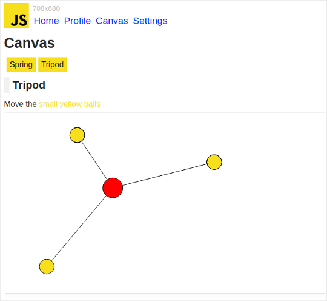

# solidjs-emotion-tailwind

Example webpack project using Solid.js with Emotion + Tailwind.

**Update:**  
**(2020/9/18)**  
**(1) core.js (2) twin.macro instead of tailwind.macro**

[1. About](#about)  
[2. Dev/Build](#dev-build)  
[2. Installed NPM Pakcages](#installed-npm-packages)  
[4. LICENSE](#license)  



[View Demo](http://tokyo800.jp/minagawah/solidjs-emotion-tailwind/)


<a id="about"></a>
## 1. About

A simple Solid.js project example.

Features:
- Webpack (split chunks, license extraction, etc.)
- Store provider (resize event, Local Storage, etc.)
- Route provider (includes switching sub pages by query params)
- Async examples (lazy load, Suspense, Show, etc.)
- Emotion + Tailwind (using `twin.macro`)
- ESLint + Prettier
- Jest

Extra Feature:
- Fun with Canvas animations (Native Canvas + PIXI.js)


<a id="dev-build"></a>
## 2. Dev/Build

### Dev

Starting `webpack-dev-server`:

```bash
yarn start
```

ESLint:

```bash
yarn lint
```

Test (Jest):

```bash
yarn test
```

### Build

Build bundles to `build` directory:

```bash
yarn build
```


<a id="installed-npm-packages"></a>
## 3. Installed NPM Packages


### prod

For main features:
- solid-js
- ramda
- pixi.js
- pixi.js-legacy
- @pixi/canvas-graphics

For CSS (Emotion + TailwindCSS):
- emotion
- tailwindcss
- twin.macro

```bash
yarn add solid-js ramda emotion tailwindcss twin.macro pixi.js pixi.js-legacy
```


### dev

For Babel:  
`@babel/polyfill` has been deprecated, we use `core-js`.

- @babel/core
- @babel/preset-env
- @babel/cli
- core-js@3
- @babel/runtime-corejs3

For Babel (for Emotion):
- babel-plugin-macros

For Babel (for Solid):
- babel-preset-solid

For ESLint + Prettier:
- babel-eslint
- eslint
- eslint-loader
- prettier

For Webpack:
- webpack
- webpack-cli
- webpack-dev-server
- webpack-merge
- html-webpack-plugin
- clean-webpack-plugin
- babel-loader
- file-loader

For Webpack (Other Goodies):
- license-webpack-plugin
- copy-webpack-plugin (Not installed)

For CSS:

Although `autoprefixer` and `normalize` are already in `tailwindcss`, we need `autoprefixer` when PostCSS loads CSS in Webpack process.

- css-loader
- style-loader
- postcss-loader
- autoprefixer
- mini-css-extract-plugin

For Jest:

- jest
- jest-emotion

```bash
yarn add --dev @babel/core @babel/preset-env @babel/cli core-js@3 @babel/runtime-corejs3 babel-plugin-macros babel-preset-solid babel-eslint eslint eslint-loader prettier webpack webpack-cli webpack-dev-server webpack-merge html-webpack-plugin clean-webpack-plugin babel-loader file-loader license-webpack-plugin css-loader style-loader postcss-loader autoprefixer mini-css-extract-plugin jest jest-emotion
```


<a id="license"></a>
## 4. License

Dual-licensed under either of the followings.  
Choose at your option.

- The UNLICENSE ([LICENSE.UNLICENSE](LICENSE.UNLICENSE))
- MIT license ([LICENSE.MIT](LICENSE.MIT))
